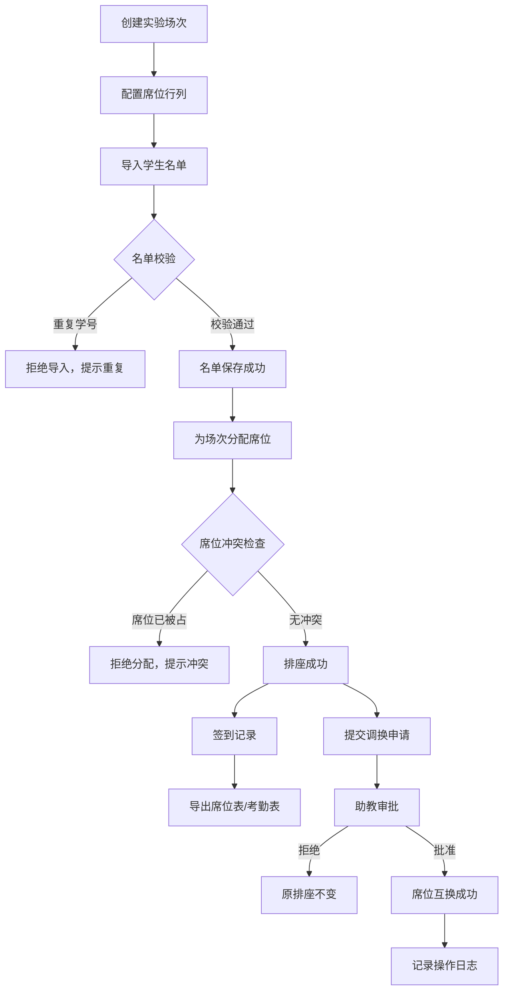

## 1. 产品概述

本地学生实验席位排课系统，面向高校实验课程管理员与助教，提供实验场次配置、席位管理、学生名单导入、自动/手动排座、调换审批、签到记录和导出功能。所有数据本地持久化（SQLite），重启后数据完整一致，无需外部服务依赖。

## 2. 核心功能

### 2.1 用户角色

| 角色 | 进入方式 | 核心权限 |
|------|----------|----------|
| 管理员 | 默认进入 | 场次增删改、名单导入、排座、导出 |
| 助教 | 角色切换 | 查看排座、审批调换、签到管理 |

### 2.2 功能模块

1. **场次管理页**：实验场次列表、创建/编辑/删除场次、配置席位行列数
2. **名单管理页**：CSV 导入学生名单、查看已有名单、样例名单下载
3. **场次详情页**：席位占用视图、排座操作、调换审批、签到记录、操作历史
4. **导出页**：导出席位分配表、导出考勤表、导出操作日志

### 2.3 页面详情

| 页面名称 | 模块名称 | 功能描述 |
|----------|----------|----------|
| 场次管理 | 场次列表 | 展示所有实验场次卡片，显示名称、日期时间、席位总数/已占数、状态 |
| 场次管理 | 创建场次 | 填写场次名称、日期、时间段、行列数，生成席位网格 |
| 场次管理 | 编辑场次 | 修改场次信息（已排座时提示不可减少席位数） |
| 名单管理 | 导入名单 | 上传 CSV 文件（学号、姓名、班级、组别），校验重复学号并拒绝 |
| 名单管理 | 名单列表 | 查看已导入名单，显示学生数量、导入时间，禁止覆盖已使用的名单 |
| 名单管理 | 样例下载 | 提供可复现的样例 CSV 下载（含 20 名学生） |
| 场次详情 | 席位视图 | 网格展示席位占用状态（空闲/已占），点击席位可分配或移除学生 |
| 场次详情 | 排座操作 | 从名单中选择学生分配到指定席位，同一席位不可重复分配 |
| 场次详情 | 调换审批 | 展示待审批调换申请，助教可批准/拒绝，强制审批需备注理由 |
| 场次详情 | 签到记录 | 显示本场次签到状态，可批量签到或逐个签到 |
| 场次详情 | 操作历史 | 展示本场次所有操作记录（排座、调换、签到、审批等） |
| 导出 | 席位表导出 | 导出 CSV：学号、姓名、班级、组别、场次、席位号 |
| 导出 | 考勤表导出 | 导出 CSV：学号、姓名、班级、组别、场次、签到状态、签到时间 |
| 导出 | 操作日志导出 | 导出 CSV：操作时间、操作类型、操作人、详情 |

## 3. 核心流程

### 3.1 主流程

管理员创建实验场次 → 配置行列生成席位 → 导入学生名单 → 为场次分配席位 → 学生签到 → 导出席位表/考勤表

### 3.2 调换审批流程

学生提交调换申请（含理由） → 助教查看待审批列表 → 批准或拒绝 → 批准后席位互换；拒绝后原排座不变

### 3.3 流程图

### 3.4 失败路径

1. **重复学号导入**：导入 CSV 时检测到学号重复，拒绝整批导入，返回重复学号列表
2. **同一场次同一席位分给两人**：分配时检查席位占用状态，已被占则拒绝，返回冲突信息
3. **助教强制审批调座**：助教审批调换时，若席位状态已变化（如一方已调走），拒绝审批，原排座不变
4. **覆盖旧名单**：已关联排座记录的名单禁止覆盖，必须先解除排座或新建名单

## 4. 用户界面设计

### 4.1 设计风格

- **主色调**：深蓝灰 (#1e293b) 搭配青色强调 (#06b6d4)，传达实验场景的专业与严谨
- **辅助色**：翡翠绿 (#10b981) 表示空闲/成功，琥珀色 (#f59e0b) 表示待审批，红色 (#ef4444) 表示冲突/失败
- **按钮风格**：圆角 (rounded-lg)，主按钮实色填充，次按钮描边
- **字体**：标题使用 Noto Sans SC Bold，正文使用 Noto Sans SC Regular
- **布局**：左侧导航栏 + 右侧内容区，内容区顶部面包屑导航
- **图标**：Lucide 图标库

### 4.2 页面设计概览

| 页面名称 | 模块名称 | UI 元素 |
|----------|----------|----------|
| 场次管理 | 场次列表 | 卡片网格，每张卡片含场次名、日期标签、席位进度条、状态徽标 |
| 场次管理 | 创建场次 | 模态对话框，表单含输入框、日期选择器、行列数调节器 |
| 名单管理 | 导入名单 | 拖拽上传区域，导入进度条，校验结果表格 |
| 名单管理 | 名单列表 | 表格视图，每行含名单名、学生数、导入时间、操作按钮 |
| 场次详情 | 席位视图 | 网格布局，席位色块表示状态（绿-空闲/蓝-已占/黄-待审批），悬停显示学生信息 |
| 场次详情 | 调换审批 | 卡片列表，每张含双方信息、理由、批准/拒绝按钮 |
| 场次详情 | 签到记录 | 表格，每行含学生信息、签到状态开关、签到时间 |
| 场次详情 | 操作历史 | 时间线列表，按时间倒序，每条含操作类型图标、描述、时间戳 |
| 导出 | 导出面板 | 三张导出卡片，预览列名，点击导出按钮下载 CSV |

### 4.3 响应式

桌面优先设计，侧边导航在窄屏收起为汉堡菜单，席位网格在小屏自动缩放。

### 4.4 持久化一致性要求

- 场次配置、调换理由、审批角色、签到状态重启后必须一致
- 导出文件列名与页面字段严格对应
- SQLite 数据库文件存于项目根目录 `data/lab.db`
