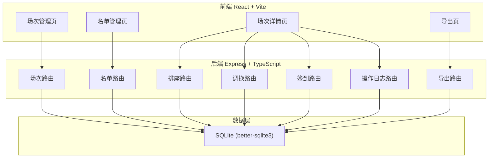
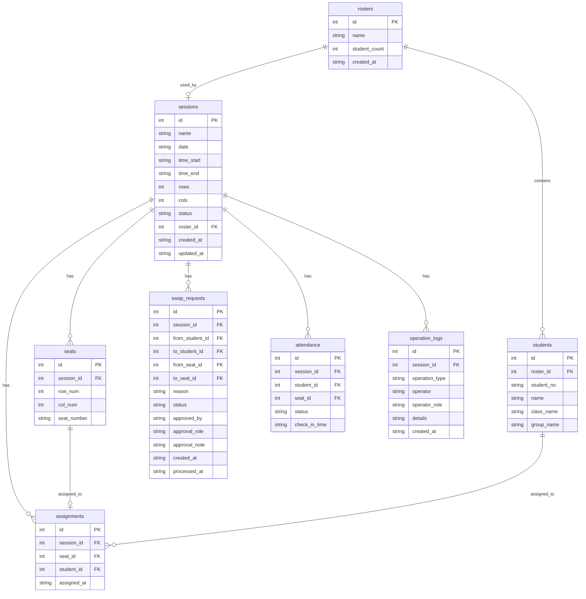

## 1. 架构设计



## 2. 技术说明

- **前端**：React@18 + TypeScript + Tailwind CSS@3 + Vite + Zustand + React Router
- **初始化工具**：vite-init（react-express-ts 模板）
- **后端**：Express@4 + TypeScript（ESM）
- **数据库**：SQLite（better-sqlite3），本地文件 `data/lab.db`
- **文件导出**：前端生成 CSV（Blob + URL.createObjectURL）
- **日期处理**：dayjs

## 3. 路由定义

| 前端路由 | 用途 |
|----------|------|
| `/` | 场次管理页 - 场次列表与创建 |
| `/roster` | 名单管理页 - 导入/查看名单 |
| `/session/:id` | 场次详情页 - 席位/调换/签到/历史 |
| `/export` | 导出页 - 导出席位表/考勤表/日志 |

| 后端路由 | 用途 |
|----------|------|
| `GET /api/sessions` | 获取所有场次 |
| `POST /api/sessions` | 创建场次 |
| `PUT /api/sessions/:id` | 更新场次 |
| `DELETE /api/sessions/:id` | 删除场次 |
| `GET /api/sessions/:id/seats` | 获取场次席位（含占用状态） |
| `GET /api/rosters` | 获取所有名单 |
| `POST /api/rosters/import` | 导入名单（CSV） |
| `GET /api/rosters/:id/students` | 获取名单下学生 |
| `DELETE /api/rosters/:id` | 删除名单（未使用时） |
| `POST /api/assignments` | 分配席位 |
| `DELETE /api/assignments/:id` | 移除排座 |
| `POST /api/swap-requests` | 提交调换申请 |
| `GET /api/swap-requests?sessionId=x` | 获取调换申请 |
| `PUT /api/swap-requests/:id/approve` | 批准调换 |
| `PUT /api/swap-requests/:id/reject` | 拒绝调换 |
| `GET /api/attendance?sessionId=x` | 获取签到记录 |
| `POST /api/attendance` | 签到/批量签到 |
| `PUT /api/attendance/:id` | 更新签到状态 |
| `GET /api/logs?sessionId=x` | 获取操作日志 |
| `GET /api/export/seats?sessionId=x` | 导出席位表数据 |
| `GET /api/export/attendance?sessionId=x` | 导出考勤表数据 |
| `GET /api/export/logs?sessionId=x` | 导出操作日志数据 |

## 4. API 定义

### 4.1 TypeScript 类型定义

```typescript
interface Session {
  id: number;
  name: string;
  date: string;
  timeStart: string;
  timeEnd: string;
  rows: number;
  cols: number;
  totalSeats: number;
  status: 'draft' | 'active' | 'completed';
  rosterId: number | null;
  createdAt: string;
  updatedAt: string;
}

interface Seat {
  id: number;
  sessionId: number;
  row: number;
  col: number;
  seatNumber: string;
  status: 'free' | 'occupied';
  studentId: number | null;
  studentName: string | null;
  studentNo: string | null;
}

interface Roster {
  id: number;
  name: string;
  studentCount: number;
  inUse: boolean;
  createdAt: string;
}

interface Student {
  id: number;
  rosterId: number;
  studentNo: string;
  name: string;
  className: string;
  groupName: string;
}

interface Assignment {
  id: number;
  sessionId: number;
  seatId: number;
  studentId: number;
  studentNo: string;
  studentName: string;
  seatNumber: string;
  assignedAt: string;
}

interface SwapRequest {
  id: number;
  sessionId: number;
  fromStudentId: number;
  toStudentId: number;
  fromSeatId: number;
  toSeatId: number;
  fromStudentNo: string;
  fromStudentName: string;
  toStudentNo: string;
  toStudentName: string;
  fromSeatNumber: string;
  toSeatNumber: string;
  reason: string;
  status: 'pending' | 'approved' | 'rejected';
  approvedBy: string | null;
  approvalRole: 'admin' | 'ta' | null;
  approvalNote: string | null;
  createdAt: string;
  processedAt: string | null;
}

interface AttendanceRecord {
  id: number;
  sessionId: number;
  studentId: number;
  studentNo: string;
  studentName: string;
  seatNumber: string;
  status: 'not_checked_in' | 'checked_in' | 'late' | 'absent';
  checkInTime: string | null;
}

interface OperationLog {
  id: number;
  sessionId: number;
  operationType: 'assign' | 'unassign' | 'swap_request' | 'swap_approve' | 'swap_reject' | 'check_in' | 'import_roster' | 'create_session';
  operator: string;
  operatorRole: 'admin' | 'ta';
  details: string;
  createdAt: string;
}
```

### 4.2 请求/响应示例

**创建场次**
- 请求：`POST /api/sessions` → `{ name, date, timeStart, timeEnd, rows, cols }`
- 响应：`{ success: true, data: Session }`

**导入名单**
- 请求：`POST /api/rosters/import` → `FormData { file, name }`
- 响应（成功）：`{ success: true, data: { rosterId, imported, duplicates: [] } }`
- 响应（失败-重复学号）：`{ success: false, error: "DUPLICATE_STUDENT_NO", duplicates: ["2024001", "2024005"] }`

**分配席位**
- 请求：`POST /api/assignments` → `{ sessionId, seatId, studentId }`
- 响应（成功）：`{ success: true, data: Assignment }`
- 响应（失败-席位被占）：`{ success: false, error: "SEAT_OCCUPIED", message: "席位已被占用" }`
- 响应（失败-学生已排座）：`{ success: false, error: "STUDENT_ALREADY_ASSIGNED", message: "该学生已在本场次排座" }`

**批准调换**
- 请求：`PUT /api/swap-requests/:id/approve` → `{ approverRole, approvalNote? }`
- 响应（成功）：`{ success: true }`
- 响应（失败-席位已变）：`{ success: false, error: "SEAT_CHANGED", message: "席位状态已变化，原排座不变" }`

## 5. 服务器架构


- **Controller**：处理 HTTP 请求、参数校验、响应格式化
- **Service**：业务逻辑（冲突检测、事务管理、日志记录）
- **Repository**：SQL 查询封装、数据映射

## 6. 数据模型

### 6.1 数据模型定义



### 6.2 数据定义语言

```sql
CREATE TABLE IF NOT EXISTS sessions (
  id INTEGER PRIMARY KEY AUTOINCREMENT,
  name TEXT NOT NULL,
  date TEXT NOT NULL,
  time_start TEXT NOT NULL,
  time_end TEXT NOT NULL,
  rows INTEGER NOT NULL DEFAULT 5,
  cols INTEGER NOT NULL DEFAULT 8,
  status TEXT NOT NULL DEFAULT 'draft' CHECK(status IN ('draft', 'active', 'completed')),
  roster_id INTEGER,
  created_at TEXT NOT NULL DEFAULT (datetime('now', 'localtime')),
  updated_at TEXT NOT NULL DEFAULT (datetime('now', 'localtime')),
  FOREIGN KEY (roster_id) REFERENCES rosters(id)
);

CREATE TABLE IF NOT EXISTS seats (
  id INTEGER PRIMARY KEY AUTOINCREMENT,
  session_id INTEGER NOT NULL,
  row_num INTEGER NOT NULL,
  col_num INTEGER NOT NULL,
  seat_number TEXT NOT NULL,
  FOREIGN KEY (session_id) REFERENCES sessions(id) ON DELETE CASCADE,
  UNIQUE(session_id, row_num, col_num)
);

CREATE TABLE IF NOT EXISTS rosters (
  id INTEGER PRIMARY KEY AUTOINCREMENT,
  name TEXT NOT NULL,
  student_count INTEGER NOT NULL DEFAULT 0,
  created_at TEXT NOT NULL DEFAULT (datetime('now', 'localtime'))
);

CREATE TABLE IF NOT EXISTS students (
  id INTEGER PRIMARY KEY AUTOINCREMENT,
  roster_id INTEGER NOT NULL,
  student_no TEXT NOT NULL,
  name TEXT NOT NULL,
  class_name TEXT NOT NULL DEFAULT '',
  group_name TEXT NOT NULL DEFAULT '',
  FOREIGN KEY (roster_id) REFERENCES rosters(id) ON DELETE CASCADE,
  UNIQUE(roster_id, student_no)
);

CREATE TABLE IF NOT EXISTS assignments (
  id INTEGER PRIMARY KEY AUTOINCREMENT,
  session_id INTEGER NOT NULL,
  seat_id INTEGER NOT NULL,
  student_id INTEGER NOT NULL,
  assigned_at TEXT NOT NULL DEFAULT (datetime('now', 'localtime')),
  FOREIGN KEY (session_id) REFERENCES sessions(id) ON DELETE CASCADE,
  FOREIGN KEY (seat_id) REFERENCES seats(id) ON DELETE CASCADE,
  FOREIGN KEY (student_id) REFERENCES students(id),
  UNIQUE(session_id, seat_id),
  UNIQUE(session_id, student_id)
);

CREATE TABLE IF NOT EXISTS swap_requests (
  id INTEGER PRIMARY KEY AUTOINCREMENT,
  session_id INTEGER NOT NULL,
  from_student_id INTEGER NOT NULL,
  to_student_id INTEGER NOT NULL,
  from_seat_id INTEGER NOT NULL,
  to_seat_id INTEGER NOT NULL,
  reason TEXT NOT NULL DEFAULT '',
  status TEXT NOT NULL DEFAULT 'pending' CHECK(status IN ('pending', 'approved', 'rejected')),
  approved_by TEXT,
  approval_role TEXT CHECK(approval_role IN ('admin', 'ta')),
  approval_note TEXT,
  created_at TEXT NOT NULL DEFAULT (datetime('now', 'localtime')),
  processed_at TEXT,
  FOREIGN KEY (session_id) REFERENCES sessions(id) ON DELETE CASCADE,
  FOREIGN KEY (from_student_id) REFERENCES students(id),
  FOREIGN KEY (to_student_id) REFERENCES students(id),
  FOREIGN KEY (from_seat_id) REFERENCES seats(id),
  FOREIGN KEY (to_seat_id) REFERENCES seats(id)
);

CREATE TABLE IF NOT EXISTS attendance (
  id INTEGER PRIMARY KEY AUTOINCREMENT,
  session_id INTEGER NOT NULL,
  student_id INTEGER NOT NULL,
  seat_id INTEGER NOT NULL,
  status TEXT NOT NULL DEFAULT 'not_checked_in' CHECK(status IN ('not_checked_in', 'checked_in', 'late', 'absent')),
  check_in_time TEXT,
  FOREIGN KEY (session_id) REFERENCES sessions(id) ON DELETE CASCADE,
  FOREIGN KEY (student_id) REFERENCES students(id),
  FOREIGN KEY (seat_id) REFERENCES seats(id),
  UNIQUE(session_id, student_id)
);

CREATE TABLE IF NOT EXISTS operation_logs (
  id INTEGER PRIMARY KEY AUTOINCREMENT,
  session_id INTEGER,
  operation_type TEXT NOT NULL,
  operator TEXT NOT NULL DEFAULT 'admin',
  operator_role TEXT NOT NULL DEFAULT 'admin' CHECK(operator_role IN ('admin', 'ta')),
  details TEXT NOT NULL DEFAULT '',
  created_at TEXT NOT NULL DEFAULT (datetime('now', 'localtime')),
  FOREIGN KEY (session_id) REFERENCES sessions(id) ON DELETE SET NULL
);

CREATE INDEX IF NOT EXISTS idx_seats_session ON seats(session_id);
CREATE INDEX IF NOT EXISTS idx_students_roster ON students(roster_id);
CREATE INDEX IF NOT EXISTS idx_assignments_session ON assignments(session_id);
CREATE INDEX IF NOT EXISTS idx_swap_requests_session ON swap_requests(session_id);
CREATE INDEX IF NOT EXISTS idx_swap_requests_status ON swap_requests(status);
CREATE INDEX IF NOT EXISTS idx_attendance_session ON attendance(session_id);
CREATE INDEX IF NOT EXISTS idx_logs_session ON operation_logs(session_id);
CREATE INDEX IF NOT EXISTS idx_logs_created ON operation_logs(created_at);
```
